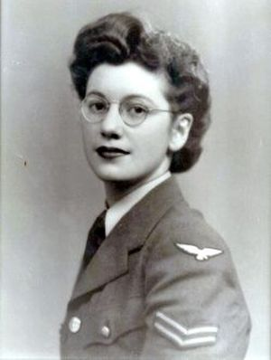

## Joan Clarke
Fue una criptoanalista matemática, numismática, informática teórica.Fue la única mujer que trabajo en el proyecto Enigma que desencriptaba las comunicaciones secretas de la alemana nazi.

