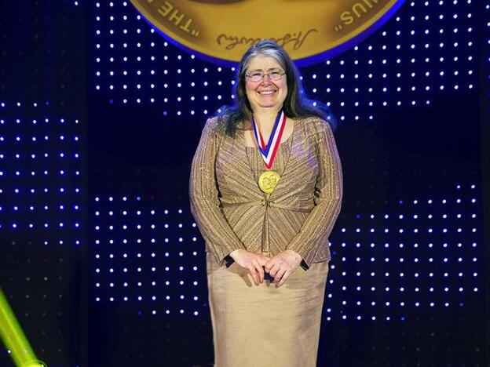

## Radia Joy Perlam
Fue creadora de software de sistemas de programación e ingeniería de redes, creadora del protocolo spanning tree que permite a los puentes de la red ubicar bucles en una red de área local y aprendió a programar para una clase de física.

